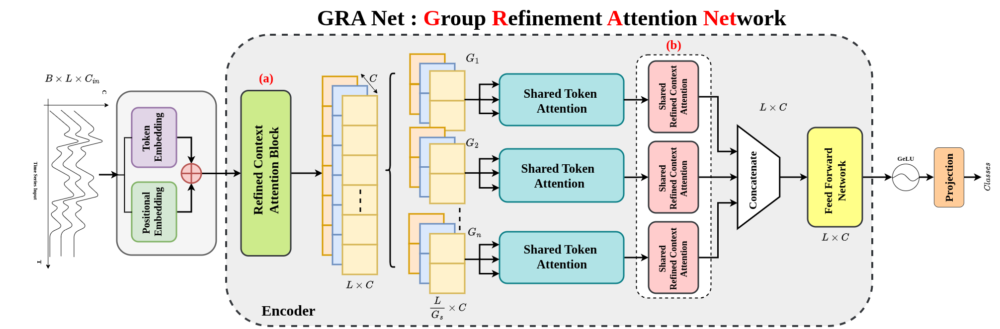
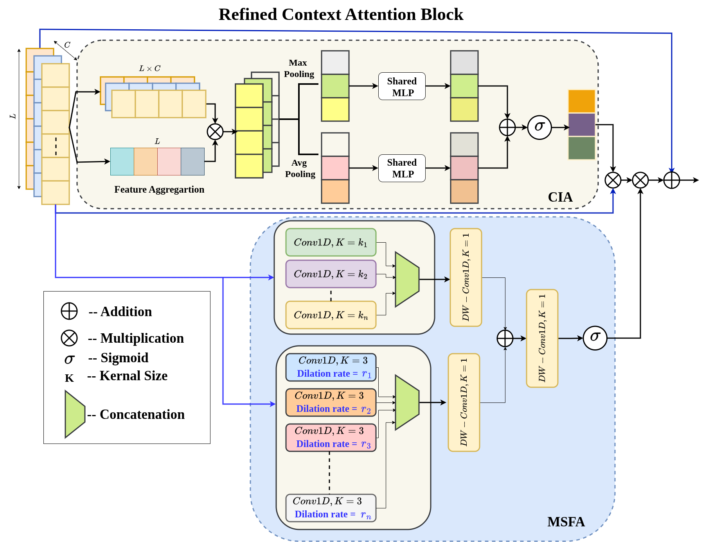

# GRA-Net-Grouped-Refinement-Attention-Network-for-Medical-Time-Series-Classification

## Abstract
 Accurate classification of medical time series (MeDTS) is essential for reliable clinical diagnosis but remains challenging due to complex multi-channel temporal dependencies, redundant information, and limited labeled data. While transformer-based models excel in time series analysis, most are designed for forecasting and fail to fully exploit the unique characteristics of MeDTS. We propose GRA-Net **G**rouped **R**efinement **A**ttention **Net**), which captures both local and global temporal patterns while adaptively attending to critical channels and time steps. The model leverages multi-scale and dilated depthwise separable convolutions within a hierarchical attention framework, implemented via the Refined Context Attention block, to extract informative spatial and channel-wise features. A divide-and-group strategy applies attention over smaller token groups, which are further refined through learnable attention and residual connections, enabling efficient modeling. Experimental results show that GRA-Net enhances feature representations, suppresses noise, and consistently improves classification performance across diverse medical time series datasets.
## 1. Proposed Framework

*Figure 1 : Overview of the proposed GRANet architecture.*

*Figure 2 : Overview of the Proposed Refined Context Attention (RCA)Block.*
## 2. Dataset
| **Dataset** | **# Subjects** | **# Samples** | **# Classes** | **Input Channels (Cin)** | **# Timestamps** |
| :---------- | :------------: | :-----------: | :-----------: | :---------------------------------: | :--------------: |
| APAVA       |       23       |     5,967     |       2       |                  16                 |        256       |
| ADFTD       |       88       |     69,752    |       3       |                  19                 |        256       |
| PTB-XL      |     17,596     |    191,400    |       5       |                  12                 |        250       |

## 3. Results & Analysis
In the subject-independent setup, the training, validation, and test sets are partitioned at the subject level. Each subject, along with all their corresponding samples, is assigned exclusively to one of the three sets based on a predefined ratio or subject IDs. Consequently, samples from the same subject appear only in either the training, validation, or test set. The results for this configuration are reported in Table~\ref{subject_indepdt}. Our method secures the best overall average rank across all six evaluation metrics, outperforming state-of-the-art time series models, including Autoformer ([Wu et al., 2021](https://arxiv.org/abs/2106.13008)), FEDformer ([Zhou et al., 2022](https://arxiv.org/abs/2201.12740)), Informer ([Zhou et al., 2021](https://arxiv.org/abs/2012.07436)), iTransformer ([Liu et al., 2023](https://arxiv.org/abs/2310.06625)), MTST ([Zhang et al., 2024](https://arxiv.org/abs/2401.07390)), 
Nonformer ([Liu et al., 2022](https://arxiv.org/abs/2206.12381)), PatchTST ([Nie et al., 2022](https://arxiv.org/abs/2211.14730)), and the vanilla Transformer ([Vaswani et al., 2017](https://arxiv.org/abs/1706.03762))
.The best performance is achieved when the group parameter $g$ is set to 32 for APAVA, 64 for ADFTD, and 50 for PTB-XL. Notably, for the ADFTD dataset, the F1 score drops to 48.69\% in the subject-independent setup. This stark contrast highlights the increased challenge of the subject-independent scenario, which more closely reflects real-world applications. 
### 🔹 APAVA Dataset (2 Classes)
| Model               |     Acc (%)    |    Prec (%)    |     Rec (%)    |     F1 (%)     |    AUROC (%)   |    AUPRC (%)   |
| :------------------ | :------------: | :------------: | :------------: | :------------: | :------------: | :------------: |
| Autoformer          |   68.64±1.82   |   68.48±2.10   |   68.77±2.27   |   68.06±1.94   |   75.94±3.61   |   74.38±4.05   |
| FEDformer           |   74.94±2.15   |   74.59±1.50   |   73.56±3.55   |   73.51±3.39   |   83.72±1.97   |   82.94±2.37   |
| Informer            |   73.11±4.40   |   75.17±6.06   |   69.17±4.56   |   69.47±5.06   |   70.46±4.91   |   70.75±5.27   |
| iTransformer        |   74.55±1.66   |   74.77±2.10   |   71.76±1.72   |   72.30±1.79   | **85.59±1.55** | **84.39±1.57** |
| MTST                |   71.14±3.67   |   79.30±0.97   |   65.27±2.88   |   64.01±3.16   |   68.87±2.34   |   71.06±1.67   |
| Nonformer           |   71.89±3.81   |   71.80±4.58   |   69.44±3.56   |   69.74±3.48   |   70.55±2.96   |   70.78±4.06   |
| PatchTST            |   67.03±1.65   |   78.76±1.28   |   59.91±2.02   |   55.97±3.10   |   65.65±0.28   |   67.99±0.76   |
| Transformer         |   76.30±4.72   |   77.64±5.95   |   73.09±5.01   |   73.75±5.38   |   72.50±6.60   |   73.23±7.60   |
| **GRANet (g=32)** | **76.42±3.24** | **79.21±5.12** | **73.11±2.66** | **73.77±2.96** |   73.36±2.80   |   74.64±2.30   |

### 🔹 ADFTD Dataset (3 Classes)
| Model               |     Acc (%)    |    Prec (%)    |     Rec (%)    |     F1 (%)     |    AUROC (%)   |    AUPRC (%)   |
| :------------------ | :------------: | :------------: | :------------: | :------------: | :------------: | :------------: |
| Autoformer          |   45.25±1.48   |   43.67±1.94   |   42.96±2.03   |   42.59±1.85   |   61.02±1.82   |   43.10±2.30   |
| FEDformer           |   46.30±0.59   |   46.05±0.76   |   44.22±1.38   |   43.91±1.37   |   62.62±1.75   |   46.11±1.44   |
| Informer            |   48.45±1.96   |   46.54±1.68   |   46.06±1.84   |   45.74±1.38   |   65.87±1.27   |   47.60±1.30   |
| iTransformer        | **52.60±1.59** |   46.79±1.27   |   47.28±1.29   |   46.79±1.13   |   67.26±1.16   |   49.53±1.21   |
| Nonformer           |   49.95±1.05   |   47.71±0.97   |   47.46±1.50   |   46.96±1.35   |   66.23±1.37   |   47.33±1.78   |
| Transformer         |   50.47±2.14   |   49.13±1.83   |   48.01±1.53   |   48.09±1.59   |   67.93±1.59   |   48.93±2.02   |
| **GRANet (g=64)** |   51.06±2.11   | **48.92±2.09** | **48.83±2.30** | **48.69±2.27** | **69.31±1.70** | **50.97±2.05** |

### 🔹 PTB Dataset (2 Classes)
| Model               |     Acc (%)    |    Prec (%)    |     Rec (%)    |     F1 (%)     |    AUROC (%)   |    AUPRC (%)   |
| :------------------ | :------------: | :------------: | :------------: | :------------: | :------------: | :------------: |
| iTransformer        | **83.89±0.71** | **88.25±1.18** | **76.39±1.01** | **79.06±1.06** |   91.18±1.16   | **90.93±0.98** |
| Informer            |   78.69±1.68   |   82.87±1.02   |   69.19±2.90   |   70.84±3.47   | **92.09±0.53** |   90.02±0.60   |
| Crossformer         |   80.17±3.79   |   85.04±1.83   |   71.25±6.29   |   72.75±7.19   |   88.55±3.45   |   87.31±3.25   |
| **GRANet (Ours)** |   78.57±1.44   |   82.95±1.54   |   68.90±2.18   |   70.60±2.62   |   87.96±2.06   |   85.61±2.00   |

### 🔹 PTB-XL Dataset (5 Classes)
| Model               |     Acc (%)    |    Prec (%)    |     Rec (%)    |     F1 (%)     |    AUROC (%)   |    AUPRC (%)   |
| :------------------ | :------------: | :------------: | :------------: | :------------: | :------------: | :------------: |
| PatchTST            | **73.23±0.25** | **65.70±0.64** | **60.82±0.76** | **62.61±0.34** | **89.74±0.19** | **67.32±0.22** |
| MTST                |   72.14±0.27   |   63.84±0.72   |   60.01±0.81   |   61.43±0.38   |   88.97±0.33   |   65.83±0.51   |
| Informer            |   71.43±0.32   |   62.64±0.60   |   59.12±0.47   |   60.44±0.43   |   88.65±0.09   |   64.76±0.17   |
| **GRANet (g=50)** |   72.18±0.76   |   63.80±0.97   |   60.41±0.71   |   61.56±0.43   |   89.18±0.23   |   65.67±0.72   |
