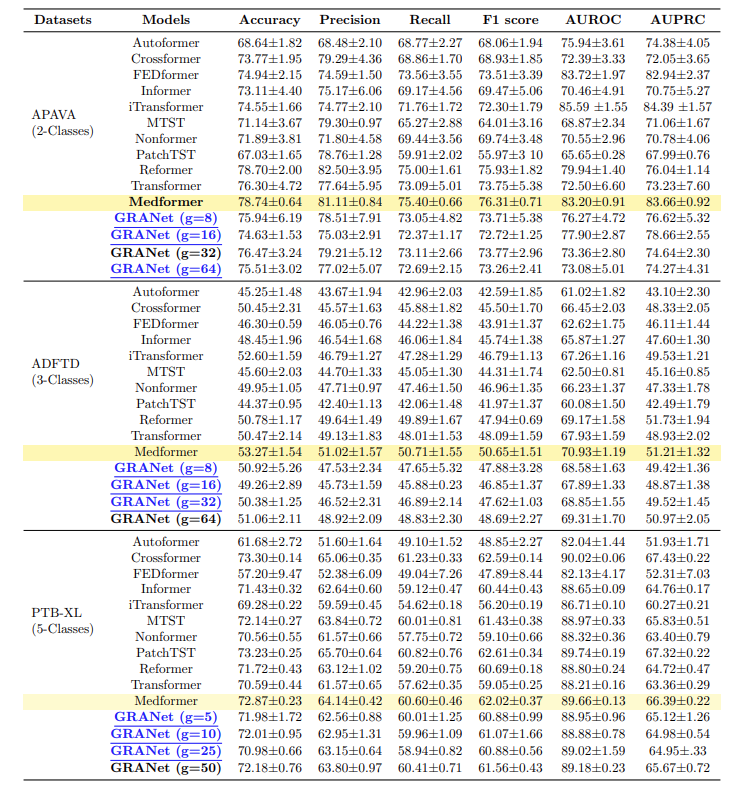

# GRA-Net-Grouped-Refinement-Attention-Network-for-Medical-Time-Series-Classification
Code will be released soon..!!

##  Ablation 
### 1. Albation study on the effect of the number of selcted groups (g) on GRA-Net performance and comparison with MedFormer

  

**Note** : The revised manuscript will replace the current Table 2 with the modified Table 2 from the above link, which presents ablation results and MedFormer results too. The requested complexity analysis is as follows and will be added to the revised manuscript.

## Complexity Analysis
Here is the formatted Markdown for your GitHub `README.md`. I have cleaned up the notation, applied LaTeX for technical clarity, and organized the sections for better readability.

---

# GRA-Net Complexity Analysis

This section provides a formal breakdown of the computational complexity for the **GRA-Net** architecture and its constituent modules.

## 1. Input Definition

Let the input time series be defined as , where:

* ****: Batch size
* ****: Sequence length
* ****: Feature dimension (channels)
* ****: Group size, resulting in  groups.

---

## 2. Module Complexity Breakdown

### Channel Importance Attention (CIA) Module

The complexity involves the interaction of sequence length and the MLP bottleneck used for channel recalibration:

*Where  is the MLP reduction ratio.*

### Multi-Scale Feature Attention (MSFA) Module

The MSFA module maintains a linear relationship with the sequence length:

### RCA Block Total

Combining the CIA and MSFA modules, the total complexity for the RCA block remains:

---

## 3. Grouped Attention Complexity

The total complexity of the standard **Scaled Dot-Product Attention** within a single group of length  is . By summing across all  groups, the total complexity is:

> [!TIP]
> By fixing the group size , the complexity becomes **linear** with respect to the sequence length , effectively avoiding the  bottleneck typically found in standard Transformers.

---

## 4. Final GRA-Net Complexity

Combining the three components above, the total complexity of **GRA-Net** is:

Given that in typical long-term forecasting scenarios:

*  (Channels are much smaller than sequence length)
*  (Group size is much smaller than sequence length)

The final complexity simplifies to ****, achieving a **linear** scale.

---
