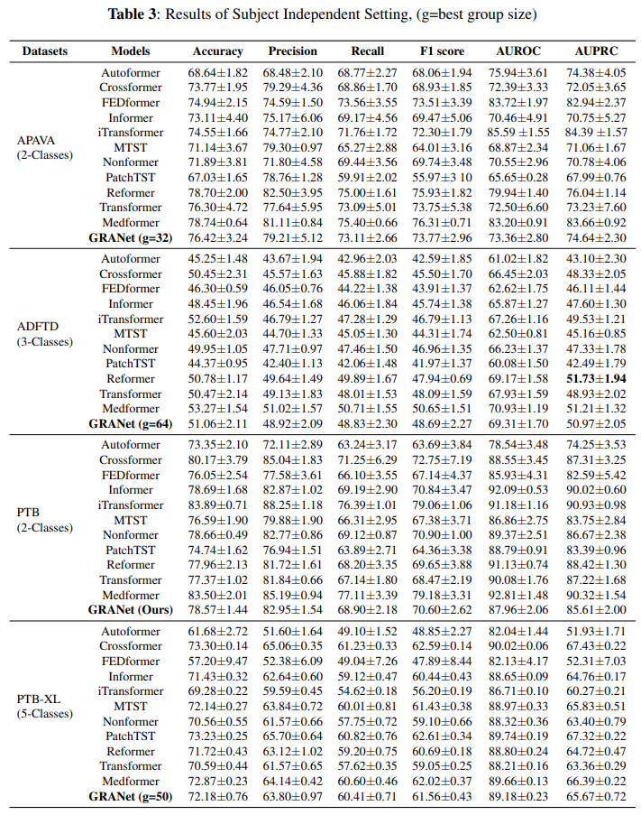
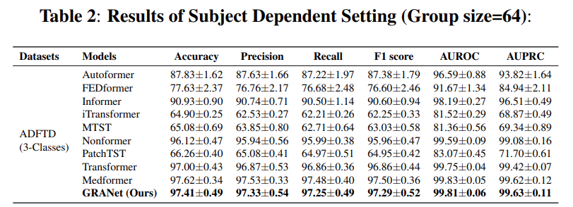

# GRA-Net-Grouped-Refinement-Attention-Network-for-Medical-Time-Series-Classification

## Abstract
 Accurate classification of medical time series (MeDTS) is essential for reliable clinical diagnosis but remains challenging due to complex multi-channel temporal dependencies, redundant information, and limited labeled data. While transformer-based models excel in time series analysis, most are designed for forecasting and fail to fully exploit the unique characteristics of MeDTS. We propose GRA-Net **G**rouped **R**efinement **A**ttention **Net**), which captures both local and global temporal patterns while adaptively attending to critical channels and time steps. The model leverages multi-scale and dilated depthwise separable convolutions within a hierarchical attention framework, implemented via the Refined Context Attention block, to extract informative spatial and channel-wise features. A divide-and-group strategy applies attention over smaller token groups, which are further refined through learnable attention and residual connections, enabling efficient modeling. Experimental results show that GRA-Net enhances feature representations, suppresses noise, and consistently improves classification performance across diverse medical time series datasets.
## 1. Proposed Framework

*Figure 1 : Overview of the proposed GRANet architecture.*

*Figure 2 : Overview of the Proposed Refined Context Attention (RCA)Block.*
## 2. Dataset
| **Dataset** | **# Subjects** | **# Samples** | **# Classes** | **Input Channels (Cin)** | **# Timestamps** |
| :---------- | :------------: | :-----------: | :-----------: | :---------------------------------: | :--------------: |
| APAVA       |       23       |     5,967     |       2       |                  16                 |        256       |
| ADFTD       |       88       |     69,752    |       3       |                  19                 |        256       |
| PTB-XL      |     17,596     |    191,400    |       5       |                  12                 |        250       |
### Processed data
Download the raw data from the links above and run notebooks in the folder `data_preprocessing/` for each raw dataset to get the processed dataset. 
The folder for processed datasets has two directories: `Feature/` and `Label/`. 
The folder `Feature/` contains files named in the format `feature_ID.npy` files for all the subjects, where ID is the patient ID. 
Each`feature_ID.npy` file contains samples belonging to the same subject and stacked into a 3-D array with shape [N-sample, T, C], where N-sample denotes the number of samples in the subject with XX ID, T denotes the timestamps for a sample, and C denotes the number of channels. 
Notice that different subjects may have different numbers of samples.
The folder `Label/` has a file named `label.npy`. This label file is a 2-D array with shape [N-subject, 2], where N-subject denotes the number of subjects. The first column is the subject's label(e.g., healthy or AD), and the second column is the subject ID, ranging from 1 to N-subject.  

The processed data should be put into `dataset/DATA_NAME/` so that each subject file can be located by `dataset/DATA_NAME/Feature/feature_ID.npy`, and the label file can be located by `dataset/DATA_NAME/Label/label.npy`.  

The processed datasets can be manually downloaded at the following links.
* APAVA dataset: https://drive.google.com/file/d/1FKvUnB8qEcHng7J9CfHaU7gqRLGeS7Ea/view?usp=drive_link
* ADFTD dataset: https://drive.google.com/file/d/1QcX_M58IQUBn3lDBlVVL0SDN7_QI1vWe/view?usp=drive_link
* PTB dataset: https://drive.google.com/file/d/14fBIXc2gSHm00wLaejNIsPgitc-wZdXu/view?usp=drive_link
* PTB-XL dataset: https://drive.google.com/file/d/1whskRvTZUNb1Qph2SeXEdpcU2rQY0T1E/view?usp=drive_link
## Experimental setups
We evaluate our model in two settings: subject-dependent and subject-independent.
In the subject-dependent setup, samples from the same subject can appear in both the training and test sets, causing information leakage. 
In a subject-independent setup, samples from the same subject are exclusively in either the training or test set, which is
more challenging and practically meaningful but less studied.

We compare with 11 time series transformer baselines: 
[Autoformer](https://github.com/thuml/Autoformer),
[Crossformer](https://github.com/Thinklab-SJTU/Crossformer),
[FEDformer](https://github.com/MAZiqing/FEDformer),
[Informer](https://github.com/zhouhaoyi/Informer2020),
[iTransformer](https://github.com/thuml/iTransformer),
[MTST](https://github.com/networkslab/MTST),
[Nonstationary_Transformer](https://github.com/thuml/Nonstationary_Transformers),
[PatchTST](https://github.com/yuqinie98/PatchTST),
[Reformer](https://github.com/lucidrains/reformer-pytorch),
[Transformer](https://github.com/jadore801120/attention-is-all-you-need-pytorch). 
[Medformer](https://github.com/DL4mHealth/Medformer/tree/main). 
We implement our method and all the baselines based on the [Time-Series-Library](https://github.com/thuml/Time-Series-Library) project from Tsinghua University, 
which integrates all methods under the same framework and training techniques to ensure a relatively fair comparison.

## Requirements  
  
The recommended requirements are specified as follows:  
* Python 3.8  
* Jupyter Notebook  
* einops==0.4.0
* matplotlib==3.7.0
* numpy==1.23.5
* pandas==1.5.3
* patool==1.12
* reformer-pytorch==1.4.4
* scikit-learn==1.2.2
* scipy==1.10.1
* sktime==0.16.1
* sympy==1.11.1
* torch==2.0.0
* tqdm==4.64.1
* wfdb==4.1.2
* neurokit2==0.2.9
* mne==1.6.1 
## 3. Results & Analysis
In the subject-independent setup, the training, validation, and test sets are partitioned at the subject level. Each subject, along with all their corresponding samples, is assigned exclusively to one of the three sets based on a predefined ratio or subject IDs. Consequently, samples from the same subject appear only in either the training, validation, or test set. The results for this configuration are reported in Table.3 . Our method secures the best overall average rank across all six evaluation metrics, outperforming state-of-the-art time series models, including Autoformer ([Wu et al., 2021](https://arxiv.org/abs/2106.13008)), FEDformer ([Zhou et al., 2022](https://arxiv.org/abs/2201.12740)), Informer ([Zhou et al., 2021](https://arxiv.org/abs/2012.07436)), iTransformer ([Liu et al., 2023](https://arxiv.org/abs/2310.06625)), MTST ([Zhang et al., 2024](https://arxiv.org/abs/2401.07390)), 
Nonformer ([Liu et al., 2022](https://arxiv.org/abs/2206.12381)), PatchTST ([Nie et al., 2022](https://arxiv.org/abs/2211.14730)), and the vanilla Transformer ([Vaswani et al., 2017](https://arxiv.org/abs/1706.03762))
.The best performance is achieved when the group parameter $g$ is set to 32 for APAVA, 64 for ADFTD, and 50 for PTB-XL. Notably, for the ADFTD dataset, the F1 score drops to 48.69\% in the subject-independent setup. This stark contrast highlights the increased challenge of the subject-independent scenario, which more closely reflects real-world applications. 

  

In the subject-dependent configuration, the training, validation, and test sets are created at the sample level. All samples from each subject are randomly shuffled and allocated to the three sets according to a fixed ratio, meaning that data from the same subject may appear across training, validation, and testing simultaneously. We applied this setup to the ADFTD EEG dataset, with results summarized in Table.2 . Our approach consistently outperforms all baselines, achieving the highest performance across all six evaluation metrics, including an exceptional Precision score of 97.29\%. It is worth noting that baseline models such as Informer, Nonformer, and Transformer also perform competitively, each achieving precision scores above 90\%.

  

## Acknowledgement

This project is constructed based on the code in repo [Medformer](https://github.com/DL4mHealth/Medformer/tree/main), [Time-Series-Library](https://github.com/thuml/Time-Series-Library).
Thanks a lot for their amazing work on implementing state-of-arts time series methods!
