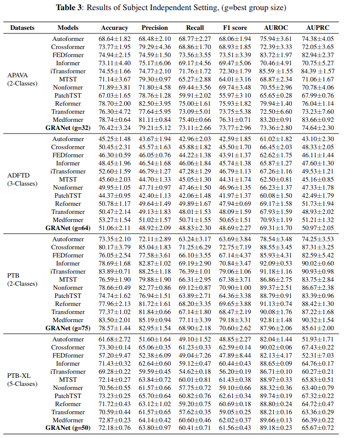

# GRA-Net-Grouped-Refinement-Attention-Network-for-Medical-Time-Series-Classification
Code will be resealing soon..!!

##  Ablation 
In the subject-independent setup, the training, validation, and test sets are partitioned at the subject level. Each subject, along with all their corresponding samples, is assigned exclusively to one of the three sets based on a predefined ratio or subject IDs. Consequently, samples from the same subject appear only in either the training, validation, or test set. The results for this configuration are reported in Table.3 . Our method secures the best overall average rank across all six evaluation metrics, outperforming state-of-the-art time series models, including Autoformer ([Wu et al., 2021](https://arxiv.org/abs/2106.13008)), FEDformer ([Zhou et al., 2022](https://arxiv.org/abs/2201.12740)), Informer ([Zhou et al., 2021](https://arxiv.org/abs/2012.07436)), iTransformer ([Liu et al., 2023](https://arxiv.org/abs/2310.06625)), MTST ([Zhang et al., 2024](https://arxiv.org/abs/2401.07390)), 
Nonformer ([Liu et al., 2022](https://arxiv.org/abs/2206.12381)), PatchTST ([Nie et al., 2022](https://arxiv.org/abs/2211.14730)), and the vanilla Transformer ([Vaswani et al., 2017](https://arxiv.org/abs/1706.03762))
.The best performance is achieved when the group parameter $g$ is set to 32 for APAVA, 64 for ADFTD, and 50 for PTB-XL. Notably, for the ADFTD dataset, the F1 score drops to 48.69\% in the subject-independent setup. This stark contrast highlights the increased challenge of the subject-independent scenario, which more closely reflects real-world applications. 

  

